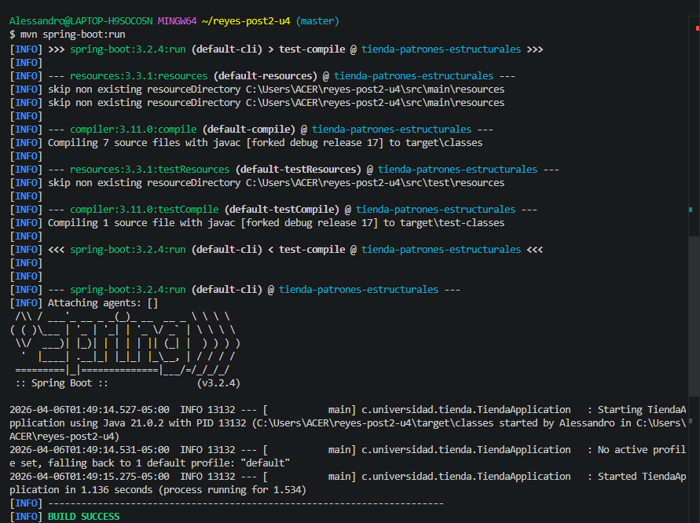

# Final Unidad 4: Observer & Strategy en Spring Boot
**Estudiante:** Alessandro Reyes Lozano  
**Repositorio:** alessandro-reyes-post2-u4

## 1. Analisis de Patrones

### Patron Strategy (Descuentos)
* **Implementacion:** Se utilizo una `List<EstrategiaDescuento>` inyectada por Spring.
* **Ventaja:** El sistema es **extensible**. Para anadir un descuento nuevo, solo se crea una nueva clase sin modificar `TiendaServicio`.

### Patron Observer (Notificaciones)
* **Implementacion:** Basado en `ApplicationEventPublisher` y `@EventListener`.
* **Flujo:** Cuando se procesa una venta, se dispara un `PedidoEvent`. Los suscriptores (`EmailListener` y `LogListener`) reaccionan de forma independiente.
* **Ventaja:** Desacoplamiento entre la logica de venta y la logica de notificacion.

## 2. Guia de Ejecucion
1. Ejecutar pruebas: `mvn test`
2. Ejecutar aplicacion: `mvn spring-boot:run`

## 3. Evidencias

# Final Unidad 4: Observer & Strategy en Spring Boot
**Estudiante:** Alessandro Reyes Lozano  
**Repositorio:** apellido-post2-u4

## 1. Análisis de Patrones

### Patrón Strategy (Descuentos)
* **Implementación:** Se utilizó una `List<EstrategiaDescuento>` inyectada por Spring. 
* **Ventaja:** El sistema es **extensible**. Para añadir un descuento de "Día del Padre", solo se crea una nueva clase sin modificar el `TiendaServicio`.

### Patrón Observer (Notificaciones)
* **Implementación:** Basado en `ApplicationEventPublisher` y `@EventListener`.
* **Flujo:** Cuando se procesa una venta, se dispara un `PedidoEvent`. Los suscriptores (`EmailListener` y `LogListener`) reaccionan de forma independiente.
* **Ventaja:** Desacoplamiento total entre la lógica de venta y la lógica de notificación.

## 2. Guía de Ejecución
1. Ejecutar pruebas: `mvn test`
2. Ejecutar aplicación: `mvn spring-boot:run`

## 3. Evidencias

